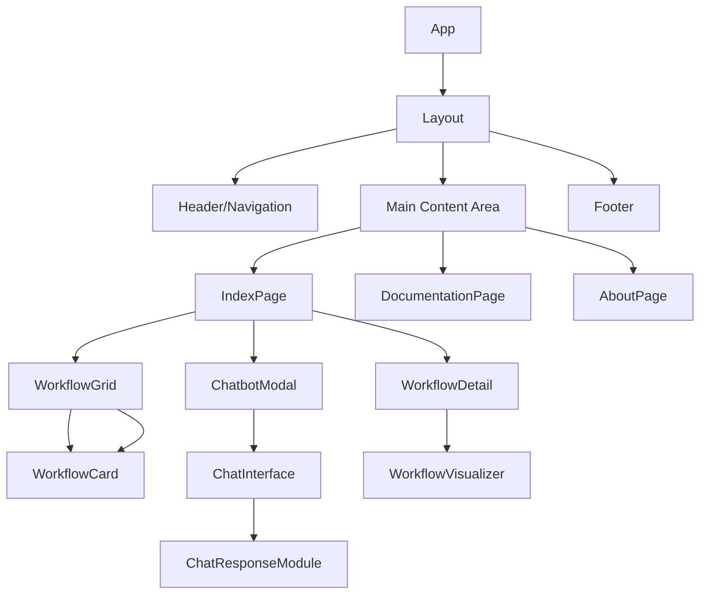
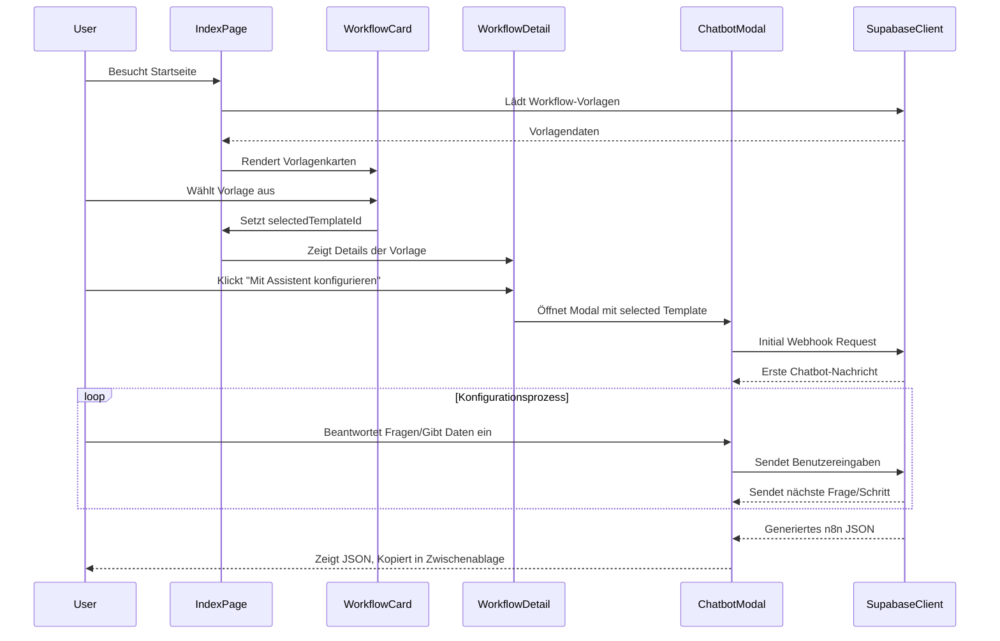
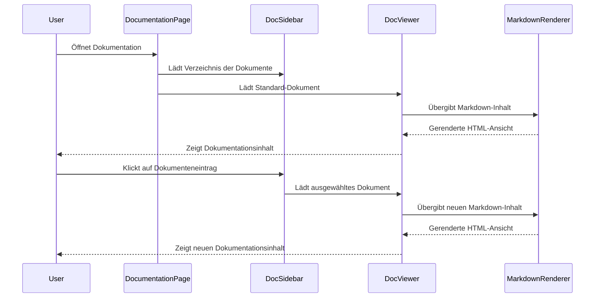

# App-Struktur, Framework und Flows

## Überblick

N.O.V.A. ist als modulare React-Anwendung aufgebaut, die auf modernen Webstandards und Best Practices basiert. Dieses Dokument beschreibt die grundlegende Struktur der Anwendung, das verwendete Framework sowie die wichtigsten Daten- und Kontrollflüsse.

## Verzeichnisstruktur

```
nova-app/
├── public/               # Statische Assets
├── src/                  # Quellcode
│   ├── components/       # Wiederverwendbare UI-Komponenten
│   │   ├── ui/           # Basis-UI-Komponenten (shadcn/ui)
│   │   └── ...           # Feature-spezifische Komponenten
│   ├── pages/            # Seitenkomponenten
│   ├── hooks/            # Benutzerdefinierte React Hooks
│   ├── lib/              # Hilfsfunktionen und Utilities
│   ├── types/            # TypeScript-Typdefinitionen
│   ├── docs/             # Markdown-Dokumentationsfiles
│   ├── data/             # Statische Daten (z.B. Workflow-Vorlagen)
│   ├── styles/           # Globale Stilanweisungen
│   ├── App.tsx           # Hauptkomponente mit Routing
│   └── main.tsx          # Einstiegspunkt der Anwendung
└── ...                   # Konfigurationsdateien
```

## Framework und Bibliotheken

### Core Framework
- **React 18**: Nutzt moderne React-Features wie Concurrent Mode, Suspense und Server Components
- **TypeScript**: Für typsichere Entwicklung
- **Vite**: Als Build-Tool und Entwicklungsserver

### UI-Framework
- **Tailwind CSS**: Utility-First CSS-Framework
- **shadcn/ui**: Komponenten-Bibliothek basierend auf Radix UI
- **Lucide React**: Für Icons

### Daten-Management
- **TanStack Query (React Query)**: Für API-Anfragen und serverseitigen Zustand
- **Supabase Client**: Für Interaktion mit dem Supabase-Backend
- **React Context API**: Für lokalen Anwendungszustand

### Routing
- **React Router 6**: Für clientseitiges Routing

### Spezial-Bibliotheken
- **ReactFlow**: Für die Workflow-Visualisierung
- **React-Markdown**: Für das Rendering von Markdown-Dokumentation

## Hauptkomponenten und deren Beziehungen

### Kernkomponenten



### Komponentenhierarchie

1. **App**: Wurzelkomponente, enthält den Router und globale Provider
   - **Layout**: Gemeinsames Layout für alle Seiten
     - **Header/Navigation**: Navigation und Branding
     - **Main Content Area**: Hauptinhaltsbereich, der je nach Route wechselt
       - **IndexPage**: Startseite mit Workflow-Auswahl
         - **WorkflowGrid**: Grid von WorkflowCard-Komponenten
         - **WorkflowDetail**: Detailansicht eines ausgewählten Workflows
         - **ChatbotModal**: Modal für den interaktiven Chatbot-Assistenten
       - **DocumentationPage**: Seite für die Dokumentation
       - **AboutPage**: Seite mit Informationen über N.O.V.A.
     - **Footer**: Fußzeile mit Links und Copyright

## Datenfluss

### Workflow-Auswahl und -Konfiguration



### Dokumentationsbereich



## Datenmodelle und Zustandsmanagement

### Hauptzustandskomponenten

1. **Vorlagendaten**: Globaler Zustand mit verfügbaren Workflow-Vorlagen
2. **Ausgewählte Vorlage**: Zustand für die aktuell ausgewählte Vorlage
3. **Chatbot-Zustand**: Zustand für den Chat-Verlauf und aktuelle Konfiguration
4. **Benutzerauthentifizierung**: Supabase Auth-Zustand (optional)

### Datenflüsse zwischen Zuständen

1. **Vorlagenauswahl**: 
   - IndexPage lädt Vorlagen vom Supabase-Backend
   - Benutzer wählt eine Vorlage aus
   - selectedTemplateId wird aktualisiert
   - WorkflowDetail-Komponente zeigt Details basierend auf der Auswahl

2. **Chatbot-Konfiguration**:
   - Benutzer startet den Assistenten für eine ausgewählte Vorlage
   - ChatbotModal initialisiert den Zustand mit der Vorlagen-ID
   - Nach jedem Benutzerinput wird der Zustand aktualisiert
   - Eingegebene Daten werden im chatConfigurationState gespeichert

3. **JSON-Generierung**:
   - Nach Abschluss der Konfiguration werden gesammelte Daten zur JSON-Generierung verwendet
   - Das generierte JSON wird im Zustand gespeichert und dem Benutzer angezeigt

## Webhooks und Backend-Interaktion

### Chatbot-Webhook-Flow

1. **Initialer Webhook**:
   - Gesendet, wenn der Chatbot gestartet wird
   - Enthält die Vorlagen-ID
   - Empfängt erste Nachricht und Eingabetyp

2. **Folge-Webhooks**:
   - Gesendet nach jeder Benutzereingabe
   - Enthält die bisherigen Eingaben und die aktuelle Antwort
   - Empfängt nächste Nachricht, Eingabetyp und ggf. Optionen

3. **Abschluss-Webhook**:
   - Gesendet, wenn alle benötigten Daten gesammelt wurden
   - Empfängt das generierte n8n JSON

### Webhook-Format

**Request:**
```json
{
  "sessionId": "unique-session-id",
  "templateId": "template-uuid",
  "step": 2,
  "input": {
    "key": "api_key",
    "value": "user-entered-value"
  },
  "allInputs": {
    "email": "user@example.com",
    "api_key": "user-entered-value"
  }
}
```

**Response:**
```json
{
  "message": "Bitte geben Sie Ihren API-Schlüssel ein:",
  "responseType": "password-input",
  "responseData": {
    "placeholder": "API-Schlüssel hier eingeben",
    "helpText": "Sie finden Ihren API-Schlüssel in den Einstellungen Ihres Kontos."
  },
  "nextStep": 3
}
```

## Performance-Optimierungen

- **Code-Splitting**: Verwendung von React.lazy() und Suspense für bedarfsgesteuertes Laden von Komponenten
- **Memoization**: Verwendung von useMemo und useCallback für rechenintensive Operationen
- **Virtualisierung**: Für lange Listen (z.B. Workflow-Vorlagen) bei Bedarf
- **Preloading**: Vorladen von wahrscheinlichen nächsten Schritten oder Dokumenten
- **Progressive Loading**: Schrittweises Laden von Inhalten, besonders bei der Dokumentation

## Erweiterbarkeit

Die modulare Struktur der Anwendung erlaubt einfache Erweiterungen:

- **Neue Workflow-Vorlagen**: Hinzufügen neuer Vorlagen zur `templates.ts` oder in die Supabase-Datenbank
- **Neue Eingabetypen**: Erweiterung von ChatResponseModule für zusätzliche Interaktionsformen
- **Neue Dokumentation**: Einfaches Hinzufügen neuer Markdown-Dateien
- **Integration weiterer Dienste**: Modulare Backend-Struktur erlaubt das Hinzufügen neuer Edge Functions

## Entwicklungsworkflow

1. **Feature-Entwicklung**:
   - Feature-Branch erstellen
   - Komponenten und Logik implementieren
   - Tests schreiben
   - Pull-Request erstellen

2. **Datenmodell-Änderungen**:
   - TypeScript-Typen aktualisieren
   - Supabase-Tabellenschema anpassen
   - Migrationsskripte erstellen

3. **Deployment**:
   - CI/CD-Pipeline testet und baut die Anwendung
   - Deployment auf Staging-Umgebung
   - Tests auf Staging
   - Deployment in Produktion

---

[Zurück zur Dokumentationsstartseite](/documentation)
