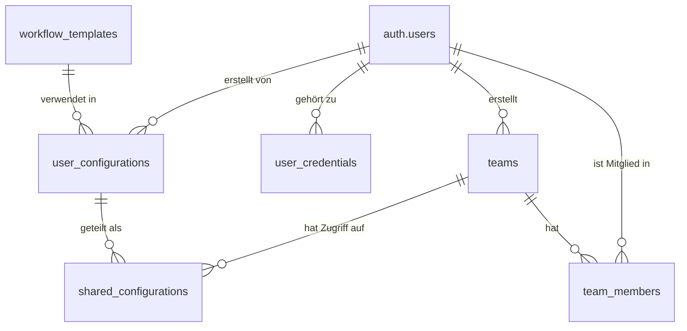

# Datenbankstruktur und Supabase-Integration

## Überblick

Die N.O.V.A.-Anwendung nutzt Supabase als Backend-Plattform, die auf PostgreSQL basiert. Dies ermöglicht eine robuste Datenverwaltung, Authentifizierung, Datenspeicherung und serverseitige Logik durch Edge Functions. Dieses Dokument beschreibt die Datenbankstruktur, Schemata, Beziehungen und Zugriffskontrollen innerhalb der Supabase-Umgebung.

## Datenbankschema

### Tabellen

#### `workflow_templates`

Speichert die verfügbaren n8n-Workflow-Vorlagen.

| Spalte | Typ | Beschreibung | Beispiel |
|--------|-----|-------------|---------|
| id | uuid | Primärschlüssel, automatisch generiert | `123e4567-e89b-12d3-a456-426614174000` |
| created_at | timestamp | Erstellungszeitpunkt | `2024-05-15 12:30:00` |
| updated_at | timestamp | Letzter Aktualisierungszeitpunkt | `2024-05-15 14:45:00` |
| title | text | Titel des Workflows | `Stripe-Kunden per E-Mail begrüßen` |
| description | text | Ausführliche Beschreibung | `Dieser Workflow sendet automatisch...` |
| short_description | text | Kurzbeschreibung für Cards | `Begrüße neue Stripe-Kunden automatisch` |
| category | text | Kategorie des Workflows | `Marketing` |
| icon | text | Lucide-Icon-Name | `mail` |
| inputs | jsonb | Array von WorkflowInput-Objekten | `[{"id": "api_key", "label": "API-Schlüssel"...}]` |
| customizable_prompts | jsonb | Array von CustomizablePrompt-Objekten | `[{"id": "welcome_email", "label": "Begrüßungs-E-Mail"...}]` |
| n8n_json_base | jsonb | JSON-Template mit Platzhaltern | `{"nodes": [...], "connections": [...]}` |
| n8n_visualization | jsonb | Visualisierungsdaten | `{"nodes": [...], "edges": [...]}` |
| created_by | uuid | ID des erstellenden Nutzers (falls nicht Standard) | `123e4567-e89b-12d3-a456-426614174001` |
| is_public | boolean | Ist die Vorlage öffentlich zugänglich | `true` |
| version | integer | Versionsnummer der Vorlage | `1` |

#### `user_configurations`

Speichert benutzerspezifische Workflow-Konfigurationen.

| Spalte | Typ | Beschreibung | Beispiel |
|--------|-----|-------------|---------|
| id | uuid | Primärschlüssel | `123e4567-e89b-12d3-a456-426614174002` |
| created_at | timestamp | Erstellungszeitpunkt | `2024-05-15 12:30:00` |
| updated_at | timestamp | Letzter Aktualisierungszeitpunkt | `2024-05-15 14:45:00` |
| user_id | uuid | Fremdschlüssel zu auth.users | `123e4567-e89b-12d3-a456-426614174003` |
| template_id | uuid | Fremdschlüssel zu workflow_templates | `123e4567-e89b-12d3-a456-426614174000` |
| name | text | Benutzerdefinierter Name | `Mein Stripe-Email-Workflow` |
| inputs | jsonb | Benutzereingaben (keine sensiblen Daten) | `{"company_name": "ACME Corp", "sender_email": "hello@acme.com"}` |
| customized_prompts | jsonb | Angepasste Prompts | `{"welcome_email": "Herzlich willkommen bei ACME..."}` |
| generated_json | text | Generiertes n8n JSON (optional) | `{"nodes": [...], "connections": [...]}` |
| is_favorite | boolean | Als Favorit markiert | `false` |
| last_used | timestamp | Zeitpunkt der letzten Verwendung | `2024-05-17 09:15:00` |

#### `user_credentials` (geschützt/verschlüsselt)

Speichert verschlüsselte Anmeldeinformationen für Dienste.

| Spalte | Typ | Beschreibung |
|--------|-----|-------------|
| id | uuid | Primärschlüssel |
| created_at | timestamp | Erstellungszeitpunkt |
| updated_at | timestamp | Letzter Aktualisierungszeitpunkt |
| user_id | uuid | Fremdschlüssel zu auth.users |
| service_name | text | Name des Dienstes (z.B. "Stripe", "Gmail") |
| credential_name | text | Benutzerdefinierter Name für die Anmeldeinformation |
| encrypted_data | text | Verschlüsselte Anmeldedaten |
| type | text | Typ der Anmeldedaten (z.B. "api_key", "oauth2") |
| metadata | jsonb | Zusätzliche Metadaten (nicht sensibel) |

#### `teams` (für Team-Funktionalität)

| Spalte | Typ | Beschreibung |
|--------|-----|-------------|
| id | uuid | Primärschlüssel |
| created_at | timestamp | Erstellungszeitpunkt |
| name | text | Teamname |
| description | text | Teambeschreibung |
| created_by | uuid | Fremdschlüssel zum Ersteller |
| settings | jsonb | Teameinstellungen |

#### `team_members` (für Team-Funktionalität)

| Spalte | Typ | Beschreibung |
|--------|-----|-------------|
| id | uuid | Primärschlüssel |
| created_at | timestamp | Erstellungszeitpunkt |
| team_id | uuid | Fremdschlüssel zu teams |
| user_id | uuid | Fremdschlüssel zu auth.users |
| role | text | Rolle im Team (owner, admin, member) |

#### `shared_configurations` (für Team-Funktionalität)

| Spalte | Typ | Beschreibung |
|--------|-----|-------------|
| id | uuid | Primärschlüssel |
| created_at | timestamp | Erstellungszeitpunkt |
| configuration_id | uuid | Fremdschlüssel zu user_configurations |
| team_id | uuid | Fremdschlüssel zu teams |
| shared_by | uuid | Fremdschlüssel zum teilenden Benutzer |
| permissions | text | Berechtigungen (view, edit) |

### Views

#### `public_templates`

Eine View, die alle öffentlichen Workflow-Vorlagen anzeigt.

```sql
CREATE VIEW public_templates AS
SELECT *
FROM workflow_templates
WHERE is_public = true;
```

#### `user_template_usage`

Eine View, die die Nutzungshäufigkeit von Templates pro Benutzer anzeigt.

```sql
CREATE VIEW user_template_usage AS
SELECT 
    template_id,
    user_id,
    COUNT(*) as usage_count,
    MAX(updated_at) as last_used
FROM user_configurations
GROUP BY template_id, user_id;
```

## Beziehungsdiagramm



## Row-Level Security (RLS)

### workflow_templates

```sql
-- Alle können öffentliche Vorlagen lesen
CREATE POLICY "Öffentliche Vorlagen lesen" 
ON workflow_templates FOR SELECT 
USING (is_public = true);

-- Ersteller können ihre eigenen Vorlagen bearbeiten
CREATE POLICY "Eigene Vorlagen bearbeiten" 
ON workflow_templates FOR UPDATE 
USING (auth.uid() = created_by);

-- Nur Admins können neue Vorlagen erstellen
CREATE POLICY "Admin kann Vorlagen erstellen" 
ON workflow_templates FOR INSERT 
WITH CHECK (
  EXISTS (
    SELECT 1 FROM auth.users
    WHERE auth.users.id = auth.uid()
    AND auth.users.role = 'admin'
  )
);
```

### user_configurations

```sql
-- Benutzer sehen nur ihre eigenen Konfigurationen
CREATE POLICY "Eigene Konfigurationen sehen" 
ON user_configurations FOR SELECT 
USING (auth.uid() = user_id);

-- Benutzer können nur ihre eigenen Konfigurationen bearbeiten
CREATE POLICY "Eigene Konfigurationen bearbeiten" 
ON user_configurations FOR UPDATE 
USING (auth.uid() = user_id);

-- Benutzer können nur ihre eigenen Konfigurationen löschen
CREATE POLICY "Eigene Konfigurationen löschen" 
ON user_configurations FOR DELETE 
USING (auth.uid() = user_id);

-- Benutzer können neue Konfigurationen erstellen
CREATE POLICY "Konfigurationen erstellen" 
ON user_configurations FOR INSERT 
WITH CHECK (auth.uid() = user_id);
```

### user_credentials

```sql
-- Strenge Sicherheitsrichtlinien für Anmeldeinformationen
-- Nur der Besitzer kann seine Anmeldeinformationen sehen
CREATE POLICY "Eigene Anmeldeinformationen sehen" 
ON user_credentials FOR SELECT 
USING (auth.uid() = user_id);

-- Nur der Besitzer kann seine Anmeldeinformationen bearbeiten
CREATE POLICY "Eigene Anmeldeinformationen bearbeiten" 
ON user_credentials FOR UPDATE 
USING (auth.uid() = user_id);

-- Nur der Besitzer kann seine Anmeldeinformationen löschen
CREATE POLICY "Eigene Anmeldeinformationen löschen" 
ON user_credentials FOR DELETE 
USING (auth.uid() = user_id);

-- Benutzer können neue Anmeldeinformationen erstellen
CREATE POLICY "Anmeldeinformationen erstellen" 
ON user_credentials FOR INSERT 
WITH CHECK (auth.uid() = user_id);
```

## Edge Functions

N.O.V.A. nutzt Supabase Edge Functions für serverseitige Logik. Diese in Deno implementierten Funktionen werden für Aufgaben wie Validierung, JSON-Generierung und externe API-Integrationen verwendet.

### `validate-input`

```typescript
// src/functions/validate-input.ts
import { serve } from "https://deno.land/std@0.168.0/http/server.ts";
import { createClient } from "https://esm.sh/@supabase/supabase-js@2";

const corsHeaders = {
  "Access-Control-Allow-Origin": "*",
  "Access-Control-Allow-Headers": "authorization, x-client-info, apikey, content-type",
};

serve(async (req) => {
  if (req.method === "OPTIONS") {
    return new Response("ok", { headers: corsHeaders });
  }
  
  try {
    const supabase = createClient(
      Deno.env.get("SUPABASE_URL") ?? "",
      Deno.env.get("SUPABASE_ANON_KEY") ?? "",
      { global: { headers: { Authorization: req.headers.get("Authorization")! } } }
    );
    
    const { input_definition, user_value } = await req.json();
    
    // Validierungslogik basierend auf input_definition
    // ...
    
    return new Response(
      JSON.stringify({
        is_valid: true, // oder false mit error_message
        sanitized_value: sanitizedValue,
      }),
      {
        headers: { ...corsHeaders, "Content-Type": "application/json" },
        status: 200,
      }
    );
  } catch (error) {
    return new Response(
      JSON.stringify({ error: error.message }),
      {
        headers: { ...corsHeaders, "Content-Type": "application/json" },
        status: 400,
      }
    );
  }
});
```

### `generate-n8n-json`

```typescript
// src/functions/generate-n8n-json.ts
import { serve } from "https://deno.land/std@0.168.0/http/server.ts";
import { createClient } from "https://esm.sh/@supabase/supabase-js@2";

const corsHeaders = {
  "Access-Control-Allow-Origin": "*",
  "Access-Control-Allow-Headers": "authorization, x-client-info, apikey, content-type",
};

serve(async (req) => {
  if (req.method === "OPTIONS") {
    return new Response("ok", { headers: corsHeaders });
  }
  
  try {
    const supabase = createClient(
      Deno.env.get("SUPABASE_URL") ?? "",
      Deno.env.get("SUPABASE_ANON_KEY") ?? "",
      { global: { headers: { Authorization: req.headers.get("Authorization")! } } }
    );
    
    const { template_id, configuration_data } = await req.json();
    
    // Vorlage aus der Datenbank abrufen
    const { data: template, error } = await supabase
      .from('workflow_templates')
      .select('n8n_json_base')
      .eq('id', template_id)
      .single();
      
    if (error) throw error;
    
    // JSON generieren durch Ersetzen von Platzhaltern
    // ...
    
    return new Response(
      JSON.stringify({
        status: "success",
        n8n_json_string: generatedJson,
      }),
      {
        headers: { ...corsHeaders, "Content-Type": "application/json" },
        status: 200,
      }
    );
  } catch (error) {
    return new Response(
      JSON.stringify({ 
        status: "error",
        error_message: error.message 
      }),
      {
        headers: { ...corsHeaders, "Content-Type": "application/json" },
        status: 400,
      }
    );
  }
});
```

### `chatbot-webhook`

```typescript
// src/functions/chatbot-webhook.ts
import { serve } from "https://deno.land/std@0.168.0/http/server.ts";
import { createClient } from "https://esm.sh/@supabase/supabase-js@2";

const corsHeaders = {
  "Access-Control-Allow-Origin": "*",
  "Access-Control-Allow-Headers": "authorization, x-client-info, apikey, content-type",
};

serve(async (req) => {
  if (req.method === "OPTIONS") {
    return new Response("ok", { headers: corsHeaders });
  }
  
  try {
    const { sessionId, templateId, step, input, allInputs } = await req.json();
    
    // Implementierung der Chatbot-Logik
    // - Abrufen des Template-Schemas
    // - Bestimmung des nächsten Schritts
    // - Generierung der passenden Antwort
    // ...
    
    return new Response(
      JSON.stringify({
        message: "Bitte geben Sie XYZ ein...",
        responseType: "text-input", // oder "select", "buttons", etc.
        responseData: {
          placeholder: "Beispieltext",
          // weitere responseType-spezifische Daten
        },
        nextStep: step + 1,
      }),
      {
        headers: { ...corsHeaders, "Content-Type": "application/json" },
        status: 200,
      }
    );
  } catch (error) {
    return new Response(
      JSON.stringify({ error: error.message }),
      {
        headers: { ...corsHeaders, "Content-Type": "application/json" },
        status: 400,
      }
    );
  }
});
```

## Supabase Storage

### Buckets

#### `workflow-assets`

Speichert Bilder, Icons und andere Assets für Workflow-Vorlagen.

```typescript
// Storage-Bucket-Struktur
workflow-assets/
├── icons/                  # Icons für Workflow-Kategorien
├── template-previews/      # Vorschaubilder für Workflow-Vorlagen
└── custom-assets/          # Benutzerspezifische hochgeladene Assets
```

#### `user-data`

Speichert benutzerspezifische Daten wie exportierte JSONs oder Backup-Dateien.

```typescript
// Storage-Bucket-Struktur
user-data/
├── {user_id}/              # Pro Benutzer ein Verzeichnis
│   ├── exports/            # Exportierte JSONs
│   └── backups/            # Gesicherte Konfigurationen
└── shared/                 # Gemeinsam genutzte Dateien
```

## Authentifizierung und Berechtigungen

N.O.V.A. nutzt Supabase Auth für:

1. **Benutzerauthentifizierung**: 
   - E-Mail/Passwort
   - OAuth (Google, GitHub)
   - Magic Link

2. **Rollenbasierte Zugriffssteuerung**:
   - `user`: Standardrolle für registrierte Benutzer
   - `admin`: Erweiterte Rechte für Administratoren
   - `template_creator`: Befugnis, öffentliche Vorlagen zu erstellen

3. **Self-Service**:
   - Passwort-Zurücksetzung
   - E-Mail-Verifikation
   - Profilanpassung

## Datenverschlüsselung

Sensitive Daten wie API-Schlüssel werden zusätzlich verschlüsselt, bevor sie in der Datenbank gespeichert werden:

1. **Verschlüsselungsflow**:
   - Client erhält einen öffentlichen Schlüssel vom Server
   - Client verschlüsselt sensitive Daten clientseitig
   - Nur verschlüsselte Daten werden an den Server übertragen
   - Server speichert nur verschlüsselte Daten

2. **Entschlüsselung**:
   - Nur für die Generierung des finalen JSONs
   - Erfolgt in Edge Functions mit Zugriff auf den privaten Schlüssel
   - Entschlüsselte Daten werden nie dauerhaft gespeichert

## Migration und Datenbankevolution

Die Datenbankstruktur wird mit Migrations-Scripts verwaltet:

```sql
-- migrations/001_initial_schema.sql
CREATE TABLE workflow_templates ( ... );
CREATE TABLE user_configurations ( ... );
-- ...

-- migrations/002_add_teams.sql
CREATE TABLE teams ( ... );
CREATE TABLE team_members ( ... );
-- ...
```

## Migrationsplan zu Supabase

1. **Phase 1**: Grundlegende Integration
   - Authentifizierung einrichten
   - Basis-Tabellen anlegen
   - Edge Functions für Kernanforderungen implementieren

2. **Phase 2**: Erweiterung für Teamfunktionen
   - Teams-Tabellen hinzufügen
   - Sharing-Funktionalität implementieren
   - RLS-Policies für Teaminhalte konfigurieren

3. **Phase 3**: Optimierung und Skalierung
   - Indizes für Leistungsverbesserung
   - Caching-Strategien implementieren
   - Monitoring und Logging einrichten

---

[Zurück zur Dokumentationsstartseite](/documentation)
